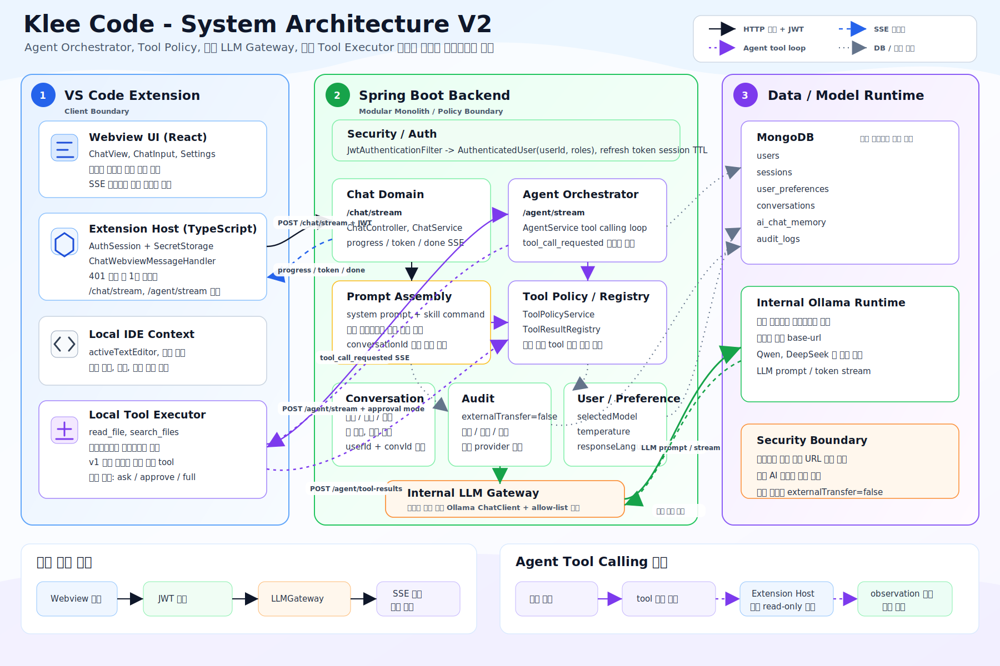
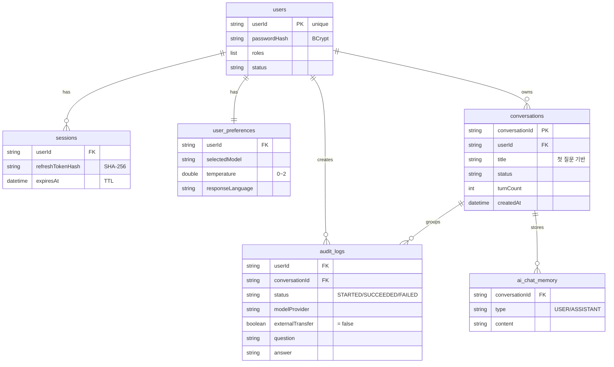

# klee-code — On-Premise AI Coding Assistant

기업 내부망의 **중앙 Ollama 서버**만 사용하는 **온프레미스(보안형) AI Coding Assistant**.

> **핵심 명제** — 코드와 프로젝트 문서가 보안 경계를 벗어나지 않으면서도, 상용 AI 코딩 도구와 동일한 UX를 제공한다.

정책 강제 지점을 백엔드 한 곳으로 집중시켜, **서버 한 대만 통제하면 보안 경계가 완성**되도록 설계했습니다. 개인용 LLM 클라이언트가 아니라, **운영자가 승인한 모델 안에서만 동작하는 어시스턴트**입니다.

<!-- 배지 자리: Java 21 · Spring Boot 4.1 · Spring AI 2.0 · React 19 · MongoDB · Ollama -->

---

## 목차

- [핵심 가치](#핵심-가치)
- [시스템 아키텍처](#시스템-아키텍처)
- [데이터 모델 (ERD)](#데이터-모델-erd)
- [기술 스택](#기술-스택)
- [모델 전략](#모델-전략)
- [폴더 구조](#폴더-구조)
- [주요 구현](#주요-구현)
- [빠른 시작](#빠른-시작)
- [사용 방법](#사용-방법)
- [설계 결정 요약 (ADR)](#설계-결정-요약-adr)
- [점진적 진화](#점진적-진화)
- [라이선스](#라이선스)

---

## 핵심 가치

| 가치 | 설명 |
|------|------|
| **중앙 LLM Gateway** | `LLMGateway` Spring Bean이 운영자 설정(`klee.llm`)의 Ollama 서버만 호출한다. 사용자는 서버 주소를 바꿀 수 없다. |
| **데이터 보안 경계** | 소스코드·프로젝트 문서를 외부 AI 서비스로 전송하지 않는다. 감사 로그에 `externalTransfer=false`를 남겨 규제 감사에 대응한다. |
| **승인 모델 선택 (allow-list)** | 사용자는 URL을 입력하지 않고, 운영자가 허용한 모델 목록에서만 하나를 선택한다. |
| **정책 강제 지점 단일화** | 인증·정책·프롬프트 조립·감사·LLM 호출은 전부 백엔드에 있다. 확장은 얇은 클라이언트로 유지한다. |

---

## 시스템 아키텍처

3-tier + 보안 경계 구조입니다. 확장은 로컬 파일 접근만, 나머지 통제는 온프렘 백엔드가 담당하는 **모듈러 모놀리스**(MSA 아님)입니다.



```text
[ VSCode 확장 (TS + React Webview) ]   ← 얇은 클라이언트, 로컬 워크스페이스 파일 접근 담당
        │ HTTP / SSE  (Bearer accessToken)
        ▼
┌──────────────────────────────────────────────────────────────┐
│  온프렘 서버 (보안 경계 · 정책 강제)                              │
│                                                                │
│   [ Spring Boot 백엔드 (모듈러 모놀리스) ]                       │
│        │                              │                        │
│        ▼                              ▼                        │
│   [ 컨텍스트 / 감사 / 대화 DB ]     [ Internal LLM Gateway ]     │
│        │                              │                        │
│        ▼                              ▼                        │
│   [ MongoDB ]                    [ Ollama 중앙 서버 ]           │
└──────────────────────────────────────────────────────────────┘
```

- **확장 = 얇은 클라이언트.** 정책·감사·프롬프트 조립은 전부 백엔드에서 수행.
- 단, **로컬 워크스페이스 파일 접근**은 백엔드가 아니라 확장(Extension Host)이 VS Code 권한 경계 안에서 수행.
- 모델 서버 주소(`klee.llm.base-url`)는 API로 조회·수정할 수 없고, 운영자가 배포 설정/환경변수로만 관리.

원본 다이어그램: [docs/architecture/chat-system-architecture.svg](docs/architecture/chat-system-architecture.svg)

### 대화가 흐르는 계층

```text
사용자 입력(코드 선택 + 질문 + permissionMode + 모델선택)
 → [Webview]        postMessage(SEND_MESSAGE)
 → [Extension Host] parseSlashCommand · buildChatRequest · readWorkspaceKleeContext(.klee)
 → POST /agent/stream (SSE, Bearer)
 → [Backend Agent]  PromptAssemblyService + ToolPromptService → AuditLog.start → LLMGateway
                    → Tool calling 루프(최대 3회)
 → SSE 이벤트(progress / token / tool_call_requested / done / error)
 → [Extension Host] tool_call_requested 수신 → executeLocalTool → POST /agent/tool-results
 → [Webview]        messageReducer → MarkdownMessage 렌더링
```

---

## 데이터 모델 (ERD)

MongoDB 6개 컬렉션. 모델 서버 주소를 저장하는 사용자별 컬렉션은 존재하지 않습니다(보안 경계의 핵심).



| 컬렉션 | 역할 |
|--------|------|
| `users` | 사용자 계정, 권한, 상태 |
| `sessions` | refresh token 세션과 TTL (토큰은 SHA-256 해시로 저장) |
| `user_preferences` | 선택 모델, temperature, 응답 언어 |
| `conversations` | 대화 목록, 제목, 턴 상태 |
| `audit_logs` | 요청/응답 감사 로그 + `externalTransfer=false` |
| `ai_chat_memory` | Spring AI `MessageChatMemoryAdvisor`가 `conversationId` 기준으로 관리 |

원본 ERD(draw.io): [docs/erd/mongoDB collection ERD.drawio](docs/erd/mongoDB%20collection%20ERD.drawio)

---

## 기술 스택

| 영역 | 기술 |
|------|------|
| **백엔드** | Java 21, Spring Boot 4.1, Spring Web MVC, Spring Security (OAuth2 JOSE JWT), Spring Data MongoDB, Gradle, Lombok |
| **LLM** | Spring AI 2.0 (Ollama + MongoDB ChatMemory) |
| **클라이언트 (Host)** | VS Code Extension API, TypeScript 5.9, SSE fetch, SecretStorage |
| **클라이언트 (Webview)** | React 19, Vite, highlight.js 11, oxlint |
| **LLM 서버** | Ollama (`qwen2.5-coder:14b` / `7b`) |
| **DB** | MongoDB 8 |
| **인증** | JWT AccessToken 15분 + RefreshToken 14일, BCrypt |
| **패키징** | Docker Compose (backend + mongo + ollama + model-pull) |

---

## 모델 전략

| 구분 | 모델 | 데이터 경계 |
|------|------|-------------|
| 기본 | `qwen2.5-coder:14b` (Ollama) | 경계 안 — 중앙 Ollama 서버에서 실행 |
| 선택 가능 | 운영자가 허용하고 Ollama에 설치된 모델 (`deepseek-coder` 등) | 경계 안 |
| 프로덕션(참고) | GPU 서버의 Qwen / DeepSeek 계열 | 경계 안 |

- `GET /models`는 실제 Ollama API로 **설치된 모델 목록**을 조회해 allow-list로 제공.
- 사용자 개인 설정에는 `selectedModel`, `temperature`, `responseLanguage`만 저장 — 서버 URL·provider·임의 endpoint는 저장하지 않음.
- 연결 실패는 사용자 메시지와 운영 로그로 분리 처리(`ChatModelExceptionMapper`).

> 개발 환경 참고: M1 / 16GB. `7b`는 Metal 가속으로 무난, `14b`는 다소 무겁고 `35b`(24GB)는 미지원. 로컬 기본값은 `7b`, Docker/운영 기본값은 `14b`.

---

## 폴더 구조

```text
klee-code/
├── backend/                         # Spring Boot (도메인별 패키지 · 모듈러 모놀리스)
│   └── src/main/java/com/kleecode/backend/
│       ├── agent/        AgentController(/agent/stream, /agent/tool-results), AgentService
│       ├── chat/         ChatController(/chat, /chat/stream, /chat/status), ChatService
│       ├── tool/         ToolRegistry · ToolPolicyService · ToolExecutorService
│       │                 · ToolResultRegistry · ToolPromptService
│       ├── permission/   PermissionMode(ASK, APPROVE, FULL)
│       ├── prompt/       PromptAssemblyService (프롬프트 조립 단일 소유자)
│       ├── llm/          LLMGateway · LlmProperties · ModelController(/models)
│       ├── conversation/ ConversationController(/conversations…)
│       ├── audit/        AuditLogService · AuditHistoryController(/audit/chat-history)
│       ├── auth/         AuthController(/auth/register,login,refresh,logout,me) · TokenService
│       ├── user/         UserService · AppUser(users 컬렉션)
│       ├── preference/   UserPreferenceController(/me/preferences)
│       ├── security/     JwtAuthenticationFilter · SecurityConfig
│       ├── common/       ApiError · ApiException · ApiExceptionHandler
│       └── config/       WebConfig(CORS)
│
├── extension/                       # VS Code 확장 (런타임 경계로 분리)
│   ├── src/extension-host/          #   VS Code 호스트 (Node 런타임)
│   │   ├── extension.ts             #   activate(): 명령 2개 + WebviewViewProvider 등록
│   │   ├── chat/                    #   context · kleeContext(.klee) · slashCommand · localTools
│   │   ├── services/                #   chatApiClient(HTTP/SSE) · authSession(SecretStorage)
│   │   └── webview/                 #   AssistantViewProvider · ChatWebviewMessageHandler
│   └── webview-ui/src/features/chat/ #  React Webview (브라우저 런타임)
│       ├── components/              #   ChatInput · MessageList · MessageBubble · MarkdownMessage
│       ├── model/                   #   messageReducer (useReducer 상태)
│       └── api/                     #   webviewProtocol · vscodeBridge
│
├── docs/
│   ├── architecture/                # STRUCTURE · TECH_STACK · chat-system-architecture.svg
│   ├── design/                      # DESIGN(ADR) · PROJECT_BRIEF
│   ├── erd/                         # mongoDB collection ERD.drawio
│   ├── development-story/           # 커밋 기반 개발 이야기
│   └── program-history/             # 작업 히스토리
│
├── docker-compose.yml               # backend + mongo + ollama + model-pull
├── .env.example
└── start.sh
```

---

## 주요 구현

### Tool Calling (핵심 설계)

네이티브 function-calling API가 아니라 **프롬프트 태그 기반**으로 구현했습니다. 모델이 아래 형식으로 응답하면 백엔드가 파싱합니다.

```text
<klee_tool_call>{"toolName":"read_file","arguments":{"path":"..."}}</klee_tool_call>
```

- **역할 분리** — `ToolRegistry`(schema 단일 소스), `ToolPolicyService`(권한 판정), `ToolExecutorService`(UUID 발급·SSE 송출·결과 대기), `ToolResultRegistry`(`CompletableFuture`, 60초 타임아웃), `ToolPromptService`(지침 렌더링).
- **실행 루프** — `AgentService`가 최대 3회까지: LLM 호출 → 태그 파싱 → 로컬 실행 요청 → `## Tool Observation N`으로 결과 누적 → 반복.
- **로컬 도구는 확장이 실행** — `read_file`(워크스페이스 이탈 방지, 최대 200KB), `search_files`(`.git`/`node_modules`/`dist`/`build` 제외, 최대 80개). schema는 백엔드가 소유해 중복 제거.
- **읽기 전용부터 시작** — 쓰기·명령 실행 도구를 붙일 때 정책 확장 지점을 명확히 하기 위한 의도적 설계.

### 프롬프트 조립 순서 (`PromptAssemblyService`)

```text
system.md → 내부 slash skill → .klee/rules → 활성 .klee/skills → .klee/hooks
→ 응답언어 → 코드 컨텍스트(선택 + 주변) → 사용자 질문
```

### Slash Skill / Rules / Hook

`/review …` 같은 slash 문법을 도입. 내부 스킬(classpath)과 프로젝트별 `.klee/{rules,skills,hooks}` 커스텀 지침을 프롬프트에 합성합니다. `/clear`는 로컬 명령으로 새 `conversationId`를 발급해 context window를 초기화합니다.

### 인증 / 세션

refreshToken은 OS 키체인(SecretStorage), accessToken은 메모리에 보관하고, 401 응답 시 refresh 후 1회 재시도합니다.

---

## 빠른 시작

### 사전 요구 사항

- Java 21+
- Node.js 20+
- Docker & Docker Compose
- (로컬 실행 시) Ollama

### 1. Ollama 모델 다운로드

```bash
ollama pull qwen2.5-coder:14b   # 로컬 개발은 qwen2.5-coder:7b 도 가능
```

### 2. 백엔드 실행

```bash
cd backend
./gradlew bootRun
```

중앙 LLM Gateway는 `src/main/resources/application.yml`에서 설정합니다(환경변수로 오버라이드 가능).

```yaml
klee:
  llm:
    provider: ollama
    base-url: ${KLEE_LLM_BASE_URL:http://ollama:11434}
    default-model: ${KLEE_LLM_DEFAULT_MODEL:qwen2.5-coder:7b}
    default-temperature: ${KLEE_LLM_DEFAULT_TEMPERATURE:0.2}
    default-response-language: ${KLEE_LLM_DEFAULT_RESPONSE_LANGUAGE:Korean}
```

### 3. VS Code 확장 설치

```bash
cd extension
npm install
npm run compile
```

F5로 Extension Development Host를 실행하거나 `.vsix`로 패키징 후 설치합니다. VS Code 설정에서 백엔드 URL을 입력합니다.

```json
{
  "klee-code.backendUrl": "http://localhost:8080"
}
```

### 4. Docker Compose로 전체 기동

Compose는 backend · MongoDB · Ollama · 모델 pull 작업을 같은 내부 Docker Network에서 실행합니다.

```bash
cp .env.example .env
docker compose up -d --build
curl http://localhost:8080/models
```

기본값(`.env.example`):

```dotenv
KLEE_LLM_DEFAULT_MODEL=qwen2.5-coder:14b
KLEE_LLM_MODEL_TO_PULL=qwen2.5-coder:14b
KLEE_LLM_DEFAULT_TEMPERATURE=0.2
KLEE_LLM_DEFAULT_RESPONSE_LANGUAGE=Korean
```

---

## 사용 방법

1. VS Code에서 코드를 선택합니다.
2. 사이드바의 Klee 뷰를 열거나 커맨드 팔레트(Cmd/Ctrl+Shift+P)에서 `Klee: Ask`를 실행합니다.
3. 질문을 입력하면 응답이 SSE로 스트리밍됩니다. 모델·권한 모드(ASK / APPROVE / FULL)는 입력창 드롭다운에서 선택합니다.
4. Agent 모드에서는 필요 시 `read_file` · `search_files` 도구가 워크스페이스 안에서만 실행됩니다.

---

## 설계 결정 요약 (ADR)

전체 결정 근거는 [docs/design/DESIGN.md](docs/design/DESIGN.md), 프로젝트 전반 브리프는 [docs/design/PROJECT_BRIEF.md](docs/design/PROJECT_BRIEF.md)에 있습니다.

- **ADR-1** 클라이언트–백엔드 분리 — 정책 강제 지점을 백엔드 한 곳으로 집중.
- **ADR-2** 중앙 LLM Gateway — 운영자 설정 Ollama만 호출(사용자는 서버 주소 변경 불가), SSRF·내부망 오남용 차단.
- **ADR-3** 모델 선택 allow-list — `GET /models`가 허용 모델만 반환, 개인 설정에는 URL을 저장하지 않음.
- **ADR-4** ChatMemory + Audit Log 유지 — `externalTransfer=false` 기록으로 규제 감사 대응.
- **ADR-5** Agent와 Tool 실행 경계 분리 — 백엔드는 정책·schema·감사, 로컬 파일 접근은 Extension Host.

---

## 점진적 진화

처음부터 완성된 설계가 아니라, 문제를 확인하며 설계를 계속 좁혀온 프로젝트입니다.

| 단계 | 내용 |
|------|------|
| Phase 0 | 뼈대: VS Code 명령 + `POST /chat` + ChatClient. 답변을 OutputChannel에 출력. |
| Phase 1 | UI: Webview 패널 → HTML 문자열 UI를 React로 이관. |
| Phase 2 | 스트리밍: SSE + Markdown 렌더링(코드펜스·하이라이트·복사 버튼). |
| Phase 3 | 컨텍스트 & 감사: 코드 컨텍스트 수집 + 감사 로그(`externalTransfer=false`) 도입. |
| Phase 4 | 다중 사용자: 로그인/JWT/세션 + 대화 히스토리 그룹화(`conversations`). |
| Phase 5 | **방향 전환**: 사용자별 Ollama URL 저장 구조를 폐기 → 중앙 `LLMGateway`로 전환. |
| Phase 6 | Skill/Rules/Hook: Slash Skill 문법 + `.klee/{rules,skills,hooks}` 합성. |
| Phase 7 | Tool Calling: `agent`/`tool`/`permission` 도메인 + 읽기 전용 도구 + permissionMode. |

**남은 과제** — MCP 서버/도구 승격, 쓰기·명령 실행 도구 + 실제 승인 팝업, 온프렘 데모 GIF, `/chat`·`/agent/stream` 통합 검토, CORS 프로덕션 제한.

자세한 개발 여정은 [docs/development-story/](docs/development-story/)에 정리되어 있습니다.

---

## 라이선스

MIT
